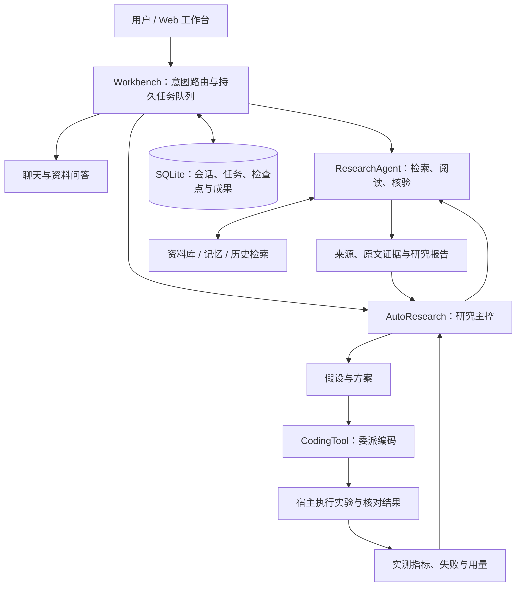

# ResearchAgent

**面向论文调研、资料问答与实验验证的本地研究工作台。**

ResearchAgent 将检索资料、阅读原文、整理证据、提出方案和运行实验放进同一个研究流程。你可以围绕一个课题管理论文与会话，让 Agent 生成带出处的回答，也可以启动 Auto Research，由研究模型规划任务、委派编码，再根据宿主执行的实验结果继续修订方案。

项目使用 Python 显式编排 Agent 循环，以 SQLite 保存任务、会话和研究状态，通过原生 Web 界面展示回答、证据和实时进度。

[快速开始](#快速开始) · [工作原理](#工作原理) · [源码教程](docs/tutorial/README.md) · [评测与数据](#评测与数据) · [优化历程](docs/optimization-history/README.md)

## 可以做什么

| 能力 | 使用方式与交付 |
| --- | --- |
| **研究区与会话** | 按课题管理共享资料、Notes 和设置；会话独立，可从指定历史消息创建分支。 |
| **论文与技术调研** | 按问题搜索网页、论文和技术文档，读取正文，整理带来源和证据引用的研究回答。 |
| **资料库与原文问答** | 下载、导入和管理论文及本地文档，分析 PDF 文字层、只读查看 GitHub 资料；答案可回到原文页码或证据片段。 |
| **检索、记忆与上下文** | 对文档、可复用记忆和会话历史分别检索；支持词法与向量混合检索、原文回读、上下文压缩和记忆管理。 |
| **研究成果管理** | 保存报告版本、证据关系、创新假设、方案和实验记录，让结论与依据保持关联。 |
| **Auto Research** | 研究模型选择调研、保存方案、委派 Codex、运行实验或结束；宿主反馈实际测量、失败信息与用量。 |
| **双路并行调研** | 将两个独立子问题交给各自拥有工具循环、证据和检查点的研究 Agent，再由主控汇总；编码和实验仍串行执行。 |
| **可观测与恢复** | 展示实时任务进度，保存 JSONL Trace、模型用量和执行检查点；支持取消、重试及满足条件的中断续跑。 |

例如，你可以提出：

- “围绕 Agent 长期记忆，调研代表性论文，比较方法、数据集与局限，并给出原文依据。”
- “根据资料库中的论文，解释这个模块为什么采用该架构，引用相关原文。”
- “分别调研方法设计和评测协议，汇总后给出实验方案。”
- “在约定的数据、指标和预算下实现这个方案，比较 baseline、candidate 和 ablation，根据实测结果决定是否继续。”

普通聊天、单次调研和资料问答可直接使用。涉及代码与实验的自动研究需要明确的执行意图、可用的本机执行环境，以及任务预算。

## 工作原理



**一次研究有明确的证据链。** 模型选择 `search`、`read`、`retrieve`、`read_evidence` 等动作；程序检查工具权限与预算，记录来源和原文片段，再对回答中的引用和事实进行核验。证据不足时可以继续补查、修订草稿，或交付带限制的结论。

**长任务有持久状态。** 研究区、消息、任务与检查点保存在 SQLite。前端通过事件流查看进度。Auto Research 委派子任务后让出 worker，结果返回后继续决策；取消、上下文失效和服务重启都有对应的状态处理。

**实验结果由宿主回收。** 研究模型负责方向与方案，Codex 负责局部实现，宿主负责约束执行、保存源码身份和运行收据，并按支持的指标合同核对预测与评分。反馈再进入研究循环；编码 Agent 的文字总结不会直接当作实测成绩。

## 快速开始

需要 **Python 3.12** 和 Git。前端无需 Node.js 构建。建议先使用离线演示熟悉界面和任务流程，再配置真实模型。

### 1. 获取源码

```bash
git clone https://github.com/prossiblezero/researchagent.git
cd researchagent
```

### 2. 安装依赖并启动离线工作台

**Windows / PowerShell：**

```powershell
python -m venv .venv
.\.venv\Scripts\python.exe -m pip install -r requirements.txt

$env:PYTHONUTF8 = "1"
$env:OFFLINE_MODE = "1"
$env:RETRIEVAL_MODE = "lexical"
.\.venv\Scripts\python.exe server.py
```

**Linux / macOS：**

```bash
python3.12 -m venv .venv
.venv/bin/python -m pip install -r requirements.txt

PYTHONUTF8=1 OFFLINE_MODE=1 RETRIEVAL_MODE=lexical .venv/bin/python server.py
```

打开 **[http://127.0.0.1:8000](http://127.0.0.1:8000)**，创建研究区和会话，即可查看聊天、后台任务、资料库与研究成果面板。按 `Ctrl+C` 停止服务。

离线模式使用固定模型与搜索/阅读样例，适合检查流程、引用和失败处理；真实论文检索、开放式问答与自动实验需要在线配置。向量检索在下一节单独启用。

也可以在 PowerShell 中运行最小 CLI 示例：

```powershell
$env:OFFLINE_MODE = "1"
.\.venv\Scripts\python.exe main.py "请查明 learn-claude-code 是什么，以及它的仓库地址。"
```

CLI 会输出回答、来源和 Trace 路径。完整的隔离练习见[首次运行教程](docs/tutorial/01-first-run.md)。

### 3. 配置真实模型与搜索

首次配置时，将 [`.env.example`](.env.example) 复制为 `.env`，填写模型和搜索凭据。默认模型客户端使用兼容 OpenAI 的 Chat Completions 接口，例如：

```dotenv
PROVIDER=deepseek
BASE_URL=https://api.deepseek.com/v1
API_KEY=your-model-api-key
MODEL=deepseek-chat
TAVILY_API_KEY=your-tavily-api-key
```

`BASE_URL`、`API_KEY`、`MODEL` 决定默认模型；网页调研还需要 Tavily 或通过 `SEARCH_URL` 配置的兼容搜索服务。模板中的 `SUDOCODE_*` 用于额外模型配置，界面会显示对应模型的可用状态。

停止离线服务，确认 `.env` 中没有启用 `OFFLINE_MODE`。PowerShell 中清除本次会话的离线开关后重启：

```powershell
Remove-Item Env:OFFLINE_MODE -ErrorAction SilentlyContinue
.\.venv\Scripts\python.exe server.py
```

Linux / macOS 的上述离线开关仅对启动命令生效；直接运行 `.venv/bin/python server.py` 即可使用 `.env` 配置。模型与搜索调用按所用服务计费。

### 4. 启用向量检索（可选）

词法检索可独立运行。需要语义召回时，显式准备固定版本的 **BGE-M3** 权重：

```powershell
.\.venv\Scripts\python.exe setup_retrieval.py
Remove-Item Env:RETRIEVAL_MODE -ErrorAction SilentlyContinue
.\.venv\Scripts\python.exe server.py
```

先停止已有服务；如果 `.env` 配置了 `RETRIEVAL_MODE=lexical`，也需移除或改为 `hybrid`。Linux / macOS 使用 `.venv/bin/python setup_retrieval.py` 下载后重启。

默认权重目录是 `data/models/bge-m3`。混合检索结合 SQLite FTS5 和 BGE-M3 / Chroma；未准备权重或向量后端不可用时，系统保留词法检索并记录降级原因，不在对话请求中自动下载模型。

### 常用配置

| 变量 | 用途 / 默认值 |
| --- | --- |
| `HOST`、`PORT` | Web 监听地址，默认 `127.0.0.1:8000`。 |
| `DB_PATH` | SQLite 路径，默认 `data/evidence_agent.db`。 |
| `OFFLINE_MODE` | 设为 `1` 时使用确定性演示；真实使用时关闭。 |
| `RETRIEVAL_MODE` | `lexical` 仅用词法检索；默认 `hybrid` 尝试混合检索。 |
| `BGE_MODEL_PATH` | 自定义 BGE-M3 权重位置；默认位于数据库所在目录的 `models/bge-m3`。 |
| `BGE_DEVICE` | 向量模型运行设备，默认 `cpu`；兼容的 CUDA 环境可设为 `cuda`。 |

默认面向本机使用，HTTP 服务没有多用户登录体系。`.env`、数据库、Trace 和实验工作区留在本地，不提交到仓库。

## 使用 Auto Research

Auto Research 适用于需要“调研 → 实现 → 实验 → 根据结果调整”的任务。一次典型流程是：

1. **明确目标。** 给出研究问题、可用资料、实验范围、指标和预算。
2. **搜集依据。** 主控调用单路或双路研究 Agent，读取原文并整理证据。
3. **保存方案。** 记录 baseline、假设、候选方法与验证方式，保留方案版本和引用。
4. **实现与测量。** 委派编码或直接运行已有实验，宿主回收源码变化、运行结果、预测与用量。
5. **解释结果。** 对有效的同条件结果进行比较，继续研究、调整方案，或带着结果与限制结束。

编码和实验执行目前依赖 **Windows 原生 `codex.exe` 与可用的 elevated 沙箱**。编码模型使用 `SUDOCODE_BASE_URL` / `SUDOCODE_API_KEY` 配置的 Responses 服务；具体启动参数见 [`experiment_process.py`](research_agent/experiment_process.py)。仅配置普通聊天模型不足以运行编码实验。Linux / macOS 上的基础工作台启动方式不包含这条原生执行路径。

实验模型调用通过宿主提供的 JSONL 批次或 stdio 连续交互接口完成，受独立调用、时间和 token 预算约束。任务结束会区分报告已交付、目标达成、外部阻塞和预算耗尽；只有满足冻结目标及有效测量条件时，才报告 `goal_met`。

源码走读见 [Auto Research](docs/tutorial/08-auto-research.md) 和[双路并行研究](docs/tutorial/09-parallel-research.md)。

## 项目结构

```text
researchagent/
├── server.py                  HTTP API、Web 页面与事件流
├── main.py                    命令行研究入口
├── research_agent/
│   ├── workbench.py           意图路由、任务调度与研究工作台
│   ├── workbench_store.py     SQLite 持久化与任务状态
│   ├── loop.py                显式 Agent 工具循环
│   ├── contracts.py           来源、证据、结论与工具响应协议
│   ├── search.py / models.py  搜索服务与模型客户端
│   ├── evidence.py / verify.py  证据整理、引用与回答核验
│   ├── library.py / materials.py  资料导入、解析与管理
│   ├── retrieval.py           文档、记忆、历史的检索与原文回读
│   ├── memory.py / context.py  记忆管理与上下文预算
│   ├── sessions.py           会话分支、检查点与恢复
│   ├── auto_research.py      自动研究主控
│   ├── coding_tool.py        编码委派与实验结果回收
│   ├── experiment_*.py       实验合同、执行、反馈与迭代
│   ├── research_records.py   报告、证据关系、假设与实验档案
│   ├── strategies.py         失败反馈、策略评测与回退
│   └── trace.py / usage.py    执行轨迹与模型用量
├── web/                      原生 HTML / CSS / JavaScript 界面
├── datasets/                 评测任务、语料、标签与来源清单
├── evals/                    核心评测、评分与审计脚本
├── tests/                    回归测试及固定测试输入
├── fixtures/                 离线搜索与阅读样例
├── docs/tutorial/            渐进式源码教程
├── setup_retrieval.py         下载固定版本的检索模型
├── requirements.txt          Python 依赖
└── .github/workflows/ci.yml   离线验收工作流
```

运行后生成的 `data/` 和 `traces/` 用于保存数据库、索引及执行轨迹，不属于源码。更完整的模块职责与阅读顺序见[项目地图](docs/tutorial/00-project-map.md)。

## 评测与数据

项目将工程合同、检索效果、完整问答和研究实验分别评测。数据输入集中在 `datasets/`，来源、用途、划分和 SHA-256 记录在 [`manifest.json`](datasets/manifest.json)。

| 评测对象 | 入口 | 关注点 |
| --- | --- | --- |
| 离线工程回归 | [`run_all.py`](evals/run_all.py) | 工具循环、证据合同、会话隔离、取消、恢复和工作台行为。 |
| 混合任务面板 | [`run_mixed_benchmark.py`](evals/run_mixed_benchmark.py) | 检索、工程任务与完整问答分开运行和计分。 |
| Agent 任务 | [`run_agent_benchmark.py`](evals/run_agent_benchmark.py) | 任务完成、重复可靠性、引用、工具调用及 token 用量。 |
| 原文证据问答 | [`run_evidence_qa_acceptance.py`](evals/run_evidence_qa_acceptance.py) | 检索命中、实际阅读、引用与最终交付。 |
| 自动研究与记忆实验 | [`run_auto_research_acceptance.py`](evals/run_auto_research_acceptance.py)、[`run_amem_acceptance.py`](evals/run_amem_acceptance.py) | 方案、执行、宿主测量与反馈闭环。 |
| 并行研究 | [`run_parallel_research_acceptance.py`](evals/run_parallel_research_acceptance.py) | 单 / 双 worker 的调度、交付质量与成本对照。 |

在 PowerShell 中运行离线检查：

```powershell
$env:PYTHONUTF8 = "1"
$env:OFFLINE_MODE = "1"
$env:RETRIEVAL_MODE = "lexical"
.\.venv\Scripts\python.exe evals/run_all.py
```

Linux / macOS 使用：

```bash
PYTHONUTF8=1 OFFLINE_MODE=1 RETRIEVAL_MODE=lexical .venv/bin/python evals/run_all.py
```

真实模型、检索权重与原生编码环境相关的评测需要另外准备；先查看对应脚本的 `--help` 与[评测教程](docs/tutorial/10-evaluation.md)，再选择任务和预算。

数据包含 QASPER、SciFact、HotpotQA、LongMemEval、LoCoMo 的固定子集以及项目场景。子集评测不等同于官方榜单；检索 Recall、引用有效率、答案正确率和实验收益各有不同分母与判定条件。外部数据的使用条件以各数据集附带的来源和许可证为准；自建 H1 字段的授权见 [DATA_LICENSE.md](datasets/DATA_LICENSE.md)。

仓库保留评测输入、核心代码和必要测试样例，不提交批量评测结果、运行日志或压缩归档。新的结果写入本地输出目录，发布范围见[仓库内容说明](docs/github-publication.md)。

## 阅读与学习

从 [Learn ResearchAgent 教程](docs/tutorial/README.md) 开始，可以沿一次请求逐步理解整个系统：

| 想了解什么 | 推荐章节 |
| --- | --- |
| 文件结构与最小运行 | [项目地图](docs/tutorial/00-project-map.md)、[首次运行](docs/tutorial/01-first-run.md) |
| Agent 怎样选择动作并引用证据 | [工具循环](docs/tutorial/02-agent-loop.md)、[证据与核验](docs/tutorial/03-evidence.md) |
| Web 请求如何变成可恢复任务 | [工作台](docs/tutorial/04-workbench.md)、[检查点与恢复](docs/tutorial/07-recovery.md) |
| RAG、记忆与上下文如何协作 | [检索与原文回读](docs/tutorial/05-retrieval.md)、[记忆与上下文](docs/tutorial/06-memory-context.md) |
| 如何把研究扩展为编码实验 | [Auto Research](docs/tutorial/08-auto-research.md)、[并行研究](docs/tutorial/09-parallel-research.md) |
| 如何评价系统、介绍工程设计 | [评测口径](docs/tutorial/10-evaluation.md)、[面试讲解与演示](docs/tutorial/11-interview.md) |

## 能力边界

- PDF 解析主要读取文字层，扫描件、复杂公式和图表可能需要人工处理；没有完整 OCR 流水线。
- 双路研究适用于独立问题，并行本身不保证提速；服务延迟、任务依赖和核验成本都会影响总耗时。
- 证据核验、受控执行和宿主评分提高可追溯性，但不保证事实永远正确、实验方法有效或结论可泛化。
- 实验隔离依赖本机 Codex 与操作系统权限机制，不等同于虚拟机隔离。Auto Research 的交付与目标达成分别记录，研究假设也可能被实验否定。
