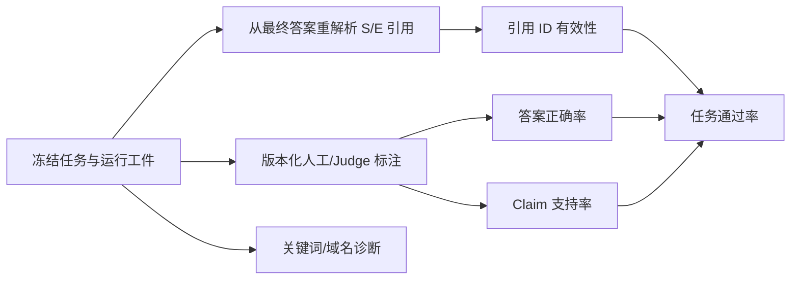

# Harness 评测：冻结边界与可信口径

## 问题

旧评测把关键词、搜索结果里的目标域名和引用 ID 存在性合成一个 `quality_pass`。这会产生两类相反错误：正确同义回答因未命中词而失败，关键词齐全但事实相反的回答却通过。旧代码还用“唯一有效引用 ID 数”除以“引用出现次数”，重复 `[S1]` 会被错误算成 50%。

2026-09-14 的四条校准样例中，当前可执行重建的旧判分为 `0/4`。因此历史 `evals/live_report*.json` 只保留追溯价值，不能继续用其中的 8/15 或 81.7% 证明 Agent 效果。

## 解决方案


> 数据集口径：活动输入统一在 `datasets/`，目录清单明确区分自建题目、外部原文快照和仅作方法参考的开源 benchmark。H1/H2/H3、V3/V4 面板都不是 LongMemEval、AgentBench、τ-bench 或 SWE-bench 的官方成绩；要声称开源 benchmark 结果，必须另行引入其原始数据、官方切分和评分器。



`evals/scoring.py` 是实时与离线评测共享的纯评分模块。它从最终交付答案重新解析每一次引用，不信任可能过时的 `RunResult.valid_citations`。关键词和域名只在 `diagnostics` 中出现；答案未经过版本化标注时，正确性和任务结果明确写成 `null / UNJUDGED`。

冻结数据为：

- `datasets/h1/h1_dev_cases.json`：50 条开发题。
- `datasets/h1/h1_test_cases.json`：100 条独立测试题，禁止用于 Prompt 调优、记忆写入或训练。

两组数据版本均为 `2026-09-14.2`，覆盖单跳、多跳、冲突、证据不足、API、时效性、
安全攻击和正常安全知识；问题、ID 和 `near_duplicate_group` 跨组零重叠。自编任务字段使用
`CC0-1.0`，外部来源 URL/内容仍遵守原来源许可，不因数据清单而重新授权。

## 工作原理

引用有效率统一按出现次数计算，并同时保留原始分子/分母：

```python
found = [f"{kind}{number}" for kind, number in CITATION_RE.findall(answer)]
valid = [citation_id for citation_id in found if citation_id in known]
rate = len(valid) / len(found) if found else None
```

每题独立运行三次，报告三个不同问题：

| 字段 | 分母 | 含义 |
|---|---:|---|
| `mean_single_run_rate` | 全部已判运行 | 随机抽一次的平均成功率 |
| `at_least_once_rate` | 每题 | 三次中至少成功一次 |
| `all_runs_rate` | 每题 | 三次全部成功，衡量可靠性 |

`answer_correctness`、`claim_support`、`citation_id_validity` 和 `task_success` 分开保存。任务通过要求版本化正确性判定、所需 Claim 支持、引用约束和拒答规则同时满足。目标域名必须由答案实际引用的 Source/Evidence 指向，不能只是在搜索结果列表中出现。

报告还记录代码与数据 SHA-256、Git commit/dirty 状态、模型、搜索/读取器、全部预算、Python/平台、终止原因、token 原始计数，以及 nearest-rank P50/P95。默认文件名带 UTC 时间戳并以独占方式创建，避免覆盖历史。

## 试一下

```powershell
conda activate evidence-agent
python evals/run_h1_calibration.py
python evals/run_metrics.py --runs 3 --json-out evals/reports/h1-offline.json
python evals/run_live_eval.py --split dev --runs 3 --judgments evals/judgments-dev.json
```

前两条不访问外网。最终 H1 校准报告是 `evals/reports/h1-calibration-final-post-audit.json`
（SHA-256 `9ac8e0fd09212f533ad403418818c163ae04a16c83e53192cec065c299fef883`）：
可执行重建的旧规则 `0/4 = 0%`，`h1.4` 为 `4/4 = 100%`。仓库没有不可变的 H1 前源码
快照，因此 baseline 明确标为 reconstructed，不冒充历史 commit。

`evals/reports/h1-calibration-20260914T124923Z.json`
（SHA-256 `5dd37415639b5b76395f2108191eb9e63039939dce0d7f1bb79a49e63331874a`）
是保留追溯的早期 h1.1 报告，不是最终证据。最终数据哈希是 dev
`c3789c47d9f08af54ccdd868602dbb97fdb64419c88894f07613e86959b37062`、
test `8bd6587d2c9b5216983e7ff675c09fea7fdef67904b49af8a8d2206ba54e53de`。

同日 `evals/reports/h1-offline-after.json`
（SHA-256 `9b28c7fc06c85dd866b1d61a5dccdb23628bb11a879db19249d77a7753d6efa2`）
实际运行 7 题各 3 次：单次 `21/21`、至少一次 `7/7`、全部成功 `7/7`；它只证明固定
fixture 的 Harness 行为没有回退，不代表通用模型正确率。

第三条会消耗真实模型和搜索额度。`--split` 选择冻结开发集或独立测试集；`--runs` 是每题独立运行次数；`--judgments` 提供含 `judge_version`、`case_id`、`run_index`、答案和 Claim 标注的 JSON。没有该文件时照常保存完整运行工件，但质量指标保持 `UNJUDGED`，不会用关键词补判。

## H2/H3 增量门禁

2026-09-15 的最终 H2 报告为 `h2-post-h3-p2-v7.json`：共享探针 `1/7 -> 7/7`，强化门禁 `14/14`，旧通过项无回归。H1 本轮校准仍为 `0/4 -> 4/4`。

H3 使用 `h3-eval-7`，三份报告均由本轮同一份 runner、全部 `test_h3*.py`、探针数据和配置生成：

| 指标 | 旧冻结 P2 before-v7 | 本次收尾前 pre-closeout-v7 | 最终 after-v7 |
|---|---:|---:|---:|
| 通过行为行 | 6/10 | 9/10 | 10/10 |
| 通过断言 | 92/118 | 115/118 | 118/118 |
| 证据可见性质量守卫 | 20/25 | 25/25 | 25/25 |
| 总模型输入字节 | 24,393 | 27,622 | 27,622 |
| 总估算 token | 8,132 | 9,208 | 9,208 |
| 峰值输入字节 / 估算 token | 7,123 / 2,375 | 7,200 / 2,400 | 7,200 / 2,400 |

文件名分别是 `evals/reports/h3-p2-before-v7.json`、`h3-p2-pre-closeout-v7.json`、`h3-p2-after-v7.json`。v6 及更早报告保留为历史记录，不再作为当前 runner 的验收输入。

严格 gate 没有放宽：与旧冻结 P2 基线相比，全部必需行通过、通过行和证据质量守卫严格改善、旧通过项无回归，且输入成本低于历史 pre-H3 上界 `69,493 bytes / 23,166` 估算 token。最终报告中 `same_runner/same_evaluation/same_data/same_config` 均为 true。质量守卫从模型实际可见正文取值，移除关键证据时必须拒答，不能靠固定答案通过。

本次收尾前报告仅失败于 `credential_redaction`：带说明文字或 Markdown 的 JSON 丢失普通字段，完整 JSON 属性名中的凭据未清除。最终版在共有脱敏入口识别有效 JSON 边界，清洗属性名与值，保留普通字段、原格式和重复字段。原 URL、Authorization 和带引号赋值的完整凭据边界优先于 JSON 拆分，避免组合时重新泄露。60 组普通/JSON 字符串/转义 JSON 与四种包装组合同时检查最终回答及 Trace；另有 13 项边界测试。已有短正文预算回归仍保持 693 通过、692 拒绝。

P2 修复使模型重新看到证据，当前总输入比旧冻结 P2 基线增加；本次两处收尾前后成本相同。历史 pre-H3 数字只是门禁的冻结成本上界，不能把它写成当前 P2 配对的压缩收益。估算公式是 `ceil(canonical UTF-8 bytes / 3)`，不是 tokenizer 精确计数。这些是离线 Harness 行为证据，不能推出真实模型答案质量。

### 复现与来源

旧冻结 P2 源码合并 SHA-256 为 `79ac7923ff6e8e5bc8f594990ab86da8493882327b6f6bd4fc843d2751eb6a9e`，已逐文件核对与历史 before-v6 的 8 个代码文件一致；不是一个新建或虚构的历史 commit。本次收尾前源码来自本次修改前保存的工作树快照。三份 v7 报告均重新执行生成，未复制旧报告改标签。

交付的 `evals/h3-p2-repair-v7.patch` 可从最终源码反向重建旧冻结 P2；`evals/h3-p2-closeout-v7.patch` 可反向重建本次收尾前源码。两份补丁均已在独立目录反向应用，并逐字节核对全部 `research_agent/*.py`。报告包含各源码版本、runner、H3 测试、数据和配置哈希，交付清单记录工件 SHA-256。复现不依赖开发机上的 `.tmp` 目录。

在已激活 `evidence-agent` 的 PowerShell 中，从最终交付目录执行；输出使用尚不存在的路径：

```powershell
$h3Replay = Join-Path ([System.IO.Path]::GetTempPath()) ("h3-v7-" + [guid]::NewGuid().ToString("N"))
New-Item -ItemType Directory -Path $h3Replay | Out-Null
Copy-Item -LiteralPath research_agent,evals,tests -Destination $h3Replay -Recurse
Push-Location $h3Replay
git apply --reverse evals/h3-p2-repair-v7.patch
python -B evals/run_h3_eval.py --label replay-before-v7 --output evals/reports/replay-before-v7.json
Pop-Location
python -B evals/run_h3_eval.py --label replay-after-v7 `
  --output evals/reports/replay-after-v7.json `
  --baseline (Join-Path $h3Replay "evals/reports/replay-before-v7.json") --require-pass
```

若要复现本次收尾前的脱敏失败，另建临时副本，把反向应用的文件换成 `h3-p2-closeout-v7.patch`；该报告用于边界回归对照，不替代严格 gate 所需的旧冻结 P2 基线。冻结 runner 或测试一旦变化，必须同时重跑 before/after，不能只更新 after。

### 本轮验证与边界

字节一致的隔离副本运行 `python -B evals/run_all.py`：`88/88` 单元测试、Stage 1 `4/4`、离线指标 `21/21` 次运行、Stage 3–7 行为检查全部通过，退出码 `0`。离线指标报告为 `evals/reports/offline-post-h3-p2-v7.json`。

历史真实 dev C 的 150 次尝试因 Windows 网络权限全部工程失败，没有可用的真实质量结论；本轮没有重跑收费 API。成功、同版本的真实 A–D 配对仍待完成。

2026-09-16 H3 v7 复审通过，已按文件同步至 researchagent。目标仓库回归、离线 CLI、本地 HTTP API 与 SQLite 联调通过；详情见 [同步记录](h1-h3-sync.md)。newagent 保持 `PAUSED_FOR_RESEARCHAGENT`，V1 实际启动及用户恢复确认仍待完成，H4 需满足源 HANDOFF 的恢复条件后再继续。
