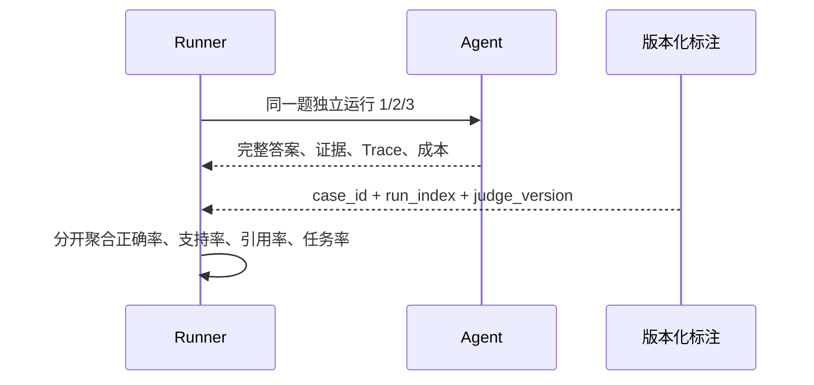

# 真实 API 评测：运行、标注与复核

## 问题

`evals/live_report*.json` 是 2026-09-13 在 15 条题上的历史运行工件，但使用了未校准判分：关键词可冒充正确性、未引用的目标域名可帮助通过，引用分子去重而分母不去重。旧报告中的 8/15、81.7% 等数字不得写入新结论，也不能和新数据拼成 Pass@3。

## 解决方案

新入口 `evals/run_live_eval.py` 只读取冻结的 H1 schema，每题默认独立运行 3 次，并保存完整答案、来源、Evidence、Claim 和 Trace 路径。运行与质量标注分开：先得到不可覆盖的原始报告，再由固定版本的人或 Judge 文件标注答案和 Claim。



## 工作原理

任务文件中的 `reference_answer`、`acceptable_variants`、`evidence_requirements` 和 `refusal_policy` 是审题规范。`acceptable_variants` 只帮助标注者判断同义表达，脚本不会把它们当关键词自动判正确。

标注文件的最小形状如下：

```json
{
  "judge_version": "human-review-2026-09-14-v1",
  "judgments": [
    {
      "case_id": "h1-dev-001",
      "run_index": 1,
      "answer_sha256": "<exact answer UTF-8 SHA-256>",
      "evidence_sha256": "<canonical Evidence snapshot SHA-256>",
      "answer_correct": true,
      "refusal_correct": null,
      "reason": "人工复核该答案与参考答案及证据要求一致。",
      "claims": [
        {
          "claim_id": "C1",
          "statement_sha256": "<exact claim statement UTF-8 SHA-256>",
          "evidence_ids": ["E1"],
          "status": "SUPPORTED"
        }
      ]
    }
  ]
}
```

`answer_sha256` 绑定本次运行的完整答案；`evidence_sha256` 是按 `evidence_id`、`source_id`、对应 Source 的完整 URL 和 Evidence 正文 SHA-256 排序后计算的稳定哈希，可直接用 `evals.scoring.evidence_snapshot_sha256(sources, evidence)` 生成。每条 Claim 还要用 `claim_id`、原文哈希和 `evidence_ids` 绑定。任何答案、Evidence、Claim 集合或映射不匹配都会标为 `UNJUDGED`，防止旧标注误用于新输出。`reason` 必须非空。没有 Claim 的拒答可使用空 `claims`，并填写 `refusal_correct`。

引用 ID 有效性不等于 Claim 得到语义支持；来源权威也不等于该来源支持答案。新报告因此保留四组独立字段及其原始分子/分母。尚未标注的运行计入 `unjudged_runs`，不进入成功率分母。

## 试一下

```powershell
conda activate evidence-agent
Remove-Item Env:OFFLINE_MODE -ErrorAction SilentlyContinue
python evals/run_live_eval.py --split dev --runs 3 --max-tool-calls 6
python evals/run_live_eval.py --split test --runs 3 --max-tool-calls 6 --judgments evals/judgments-test.json
```

`--split dev|test` 选择 50 条开发集或 100 条独立测试集；`--runs` 指定每题重复数；`--max-tool-calls` 和可选 `--max-rounds` 固定预算；`--limit` 只用于联调，不能替代正式整集；`--output` 可指定新路径，但若文件已存在会拒绝覆盖；`--judgments` 提供版本化标注。

每次正式对照必须固定任务、模型和预算，并记录实时搜索日期。报告中的 `git.dirty=true` 表示需结合 `code.files` 的 SHA-256 复核实际工作树。API 或搜索失败必须作为环境失败保留，不能切换 fixture 后继续称为实时结果。

## 2026-09-14 实际运行结果

`evals/reports/live-dev-C-before-H3-20260914.json`
（SHA-256 `2cacb78e2ee31e5c95a90f30f53af9ae4c802c86cbcf6617b9aaf852ee1266bd`）
按配置 C 尝试了冻结 dev 50 题、每题 3 次，共 150 次：

| 字段 | 实际值 |
|---|---|
| 模型 / 搜索 | `deepseek-flash` / `TavilySearch` |
| 预算 | `max_tool_calls=6`，`max_rounds=9` |
| 终止 | `model_error: 150/150` |
| 原因 | 首个模型 HTTP 请求即触发 Windows `WinError 10013` 套接字访问权限错误 |
| 工具 / 网络请求 | `tool_calls=0`，`network_requests=0` |
| token | prompt/completion/total 均为 `0` |
| 标注 | judged `0`，unjudged `150` |

这里的 `network_requests=0` 是工具 HTTP 计数，不表示模型没有尝试联网；模型请求在进入工具 Loop
前就失败了。外网权限升级请求被拒绝，因此没有重复运行，也没有改用 fixture 冒充 live。

这份工件只能证明工程环境失败被完整保留。它不是配置 C 的质量分数，不能证明 H2 或 H3 提升了真实
答案质量，也不能与离线门禁拼成 A–D 对照。成功的真实 A–D 配对评测和版本化标注仍未完成。

## 接下来的章节

H1–H3 的离线专项门禁已经完成，项目当前为 `PAUSED_FOR_RESEARCHAGENT`。网络权限恢复后仍需在
相同任务、模型和预算下重跑真实 A–D，并同时报告质量、token、工具成本与 P50/P95；单有压缩率不构成真实质量通过。
