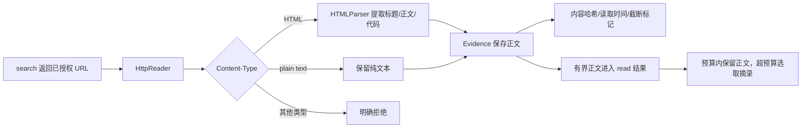

# Stage 2：把来源变成可绑定的 Evidence

Stage 2 的主线仍是 `search -> read -> Evidence`。H3 没有增加新工具，而是抽取并保存有界正文，让模型在预算内看到正文，超预算时再从正文选取摘录。

## 问题

搜索摘要通常不足以回答“原文哪一句支持结论”。旧 `read` 又直接返回 HTML：脚本、样式、导航会占上下文；一旦按字符截断，也无法知道正文是否完整。更危险的是，如果存储正文和模型摘要混在一个字段里，之后既无法复核原文，也无法准确计算模型成本。

```text
旧路径：HTTP 字节 -> 原始 HTML -> 字符截断 -> 模型 / Evidence 共用同一份文本
```

## 解决方案



`read` 仍只能读取本轮 `search` 返回过的 URL。H2 已在域名解析后检查全部地址，
把实际连接固定到已检查的地址，并在每次重定向时重新执行同一检查；正文抽取没有放宽这个边界。

## 工作原理

### 1. 只保留可读块

`research_agent/search.py` 使用标准库 `HTMLParser`。它保留 `h1`–`h6`、`p`、`li`、`pre`、`code`，也收集 `div`、表格等容器中的松散正文，并用块边界分隔内容。正文中的重复块不会因文本相同而被删除；嵌套列表的尾部文字和代码缩进也保留。

`header` 按位置处理：保留 `main/article` 内的标题与文章元数据，忽略其外的页面页眉。脚本、样式、导航等噪声及带 `hidden` 属性的内容会被忽略：

```python
_BLOCKS = {"h1", "h2", "h3", "h4", "h5", "h6", "p", "li", "pre", "code"}
_CONTENT_ROOTS = {"article", "main"}
_IGNORED = {"script", "style", "nav", "footer", "aside", "noscript", "svg", "template"}
```

没有引入正文抽取依赖。这个首版适合技术文档的常见结构；复杂阅读顺序、JavaScript 渲染页和 PDF 不在 H3 范围内。

### 2. 正文和模型视图分开

成功读取后，`ReadResponse` 和 `Evidence` 都携带：

```text
content       提取后的正文
summary       单独保存的短摘要，不替代 read 正文
title         HTML title
content_hash  正文的 SHA-256
truncated     网络字节上限或 Evidence 上限是否截断
retrieved_at  UTC 读取时间
```

`EvidenceCatalog` 最多保存 `200_000` 个正文字符；超过时保留前缀并把 `truncated=true`。默认摘要保留 `1600` 字符前缀，超长时另附截断说明。SQLite 和最终 `RunResult` 分别保存正文与摘要，以便复核。

Loop 把 Evidence 的完整有界正文放进 `read.content`，同时传 `evidence_id` 和 `content_chars`，不再附带重复的 `summary`。上下文构建器在预算内保留原请求；需要压缩时才从正文选取相关摘录，标记 `context_excerpted=true`，保留原 `content_chars` 及来源映射。这个标记表示模型只看到了摘录；`truncated` 则表示读取或存储本身受上限截断，二者不能混用。

```python
evidence = evidence_catalog.add(
    source_id,
    response.content,
    "page",
    summary=response.summary,
    content_hash=response.content_hash,
    truncated=response.truncated,
)
```

### 3. 旧 SQLite 原地迁移

启动存储时先读取 `PRAGMA table_info(evidence)`，只对缺少的列执行 `ALTER TABLE ... ADD COLUMN`。旧行不会删除，也不要求重建数据库。新增列有兼容默认值；旧程序如需回退，可以忽略这些尾部列，但应先备份数据库，因为旧程序写出的新行不会补充 H3 元数据。

## 试一下

先运行不访问外网的 H3 门禁：

```powershell
conda activate evidence-agent
python -B -m unittest tests.test_h3 tests.test_h3_regressions -v
python evals/run_h3_eval.py --label local-check `
  --output evals/reports/h3-local-check.json `
  --baseline evals/reports/h3-p2-before-v7.json --require-pass
```

`--output` 必须是尚不存在的文件，评测器拒绝覆盖历史报告。`h3-p2-before-v7.json` 是旧冻结 P2 基线，`h3-p2-pre-closeout-v7.json` 是本次两处边界修复前，`h3-p2-after-v7.json` 是最终结果；三者使用相同脚本、H3 测试、探针数据和配置。`--require-pass` 的严格增量门禁比较旧冻结 before；收尾前报告用于核对本次修复，复现步骤见 [评测文档](evaluation.md)。

运行普通离线示例：

```powershell
$env:OFFLINE_MODE = '1'
python main.py "请核验 learn-claude-code 的仓库说明，并引用正文。"
```

默认 `HttpReader(timeout=20, max_bytes=200000, max_redirects=3)`。HTML 和纯文本可读；PDF、JSON、图片或缺失 `Content-Type` 会返回 `unsupported_media_type`，不会把二进制误当正文。

## 接下来的章节

Stage 3 说明 H2 的恢复预算和 H3 的结构化上下文。H4 的语义验证与补查闭环尚未开始；当前状态是 `PAUSED_FOR_RESEARCHAGENT`。
