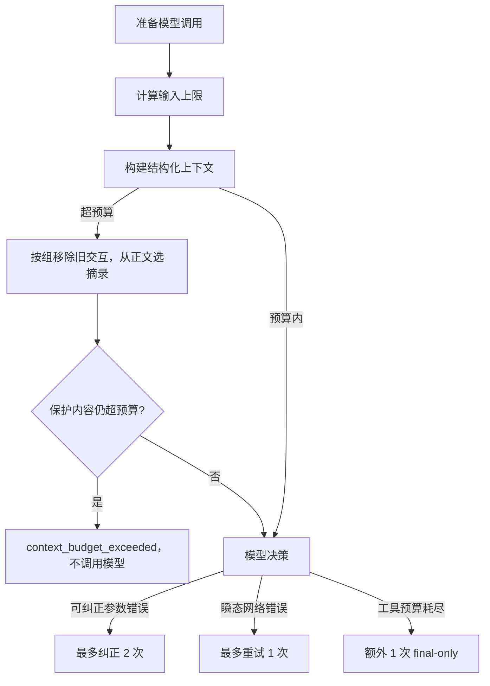

# Stage 3：多轮研究、恢复与上下文预算

## 问题

多轮工具调用有两个独立风险：错误一律终止会浪费一次可纠正机会；历史一律追加又会让长网页和旧工具结果挤掉问题、引用映射或输出空间。按字符截断整个消息列表还可能留下孤立的 `tool` 消息，使模型协议失效。

## 解决方案



H2 负责“失败后怎样恢复”，H3 负责“下一次模型实际能看到什么”。二者都在一个显式 Loop 中执行。

## 工作原理

### 1. 三份预算分开

```python
input_limit = max_context_tokens - output_reserve_tokens - safety_margin_tokens
```

- `max_context_tokens`：整个模型上下文窗口，默认 `16_384`。
- `output_reserve_tokens`：专门留给模型输出，默认 `2_048`。
- `context_safety_margin_tokens`：估算误差余量，默认 `256`。

当前没有绑定供应商 tokenizer，因此输入量明确记录为 `ceil(canonical UTF-8 bytes / 3)`，是保守估算而非精确 token。工具 schema 也计入输入。

### 2. 保护语义，再压缩旧历史

`research_agent/context.py` 先校验工具协议。没有额外传入 Claim 且原请求已在预算内时，直接返回原消息的副本，保留全部历史和 read 正文。H4 前的当前 Loop 尚未在研究中生成语义 Claim，因此通常走这个条件判断。

需要重建上下文时，保留系统规则、原问题、Source/Evidence ID 映射、最近错误和最近两组工具交互；调用方传入的未解决或冲突 Claim 也完整保留。较老交互按组移除；一组由 assistant tool call 和紧随其后的 tool result 构成，不会拆开。这里的完整是指协议配对及调用 ID，read 正文可在预算不足时缩短。

```text
预算内且无需注入 Claim：原请求原样通过
重建时保护：system + original question + structured state + latest 2 tool pairs
移除：更早的完整 tool pairs
按预算分配：旧 Evidence 摘录和最近 read 正文，避免跨消息重复
保护内容仍超限：明确失败，不静默截断受保护 Claim
```

`read` 历史首先拿到 Evidence 的完整有界正文。压缩时，页面 Evidence 的摘录直接从正文选取，不在旧的短摘要上再次截前缀。摘录结合开头、与问题相关的窗口及结尾；相关性使用去重后的英文词和中文双字词，分数相同时优先靠近正文中部。可用长度很小时只选一个相关窗口。最近 read 已提供的 Evidence 不再在 `CONTEXT_STATE` 中重复放一份摘录。

缩短 read 的候选还包括 `context_excerpted`、`content_chars` 和 JSON 转义开销，只有实际序列化后的工具交互比原文更小时才替换。短正文删掉后若标记反而更长，就保留原正文；`removed` 也只记录最终实际发生的正文变化。

未解决 Claim 的 statement/reason 不做静默 `shorten`。如果保护内容本身放不下，Loop 返回 `context_budget_exceeded`，本轮不再调用模型；如果第一次构建就超限，总模型调用次数为 0。

### 3. 恢复和终止有不同计数

- 非法参数最多回传 2 次纠正机会，计入模型轮次和 `tool_attempts`，但未执行就不计 `tool_calls`。
- 瞬态 search/read 故障最多重试 1 次；每个真实请求都计入 `network_requests`。
- 私网、凭据 URL、未知工具属于硬拒绝，不执行网络请求。
- `tool_calls` 达上限后仍允许 1 次总结，但传给模型的 `tools=[]`。若模型继续请求工具，安全停止。

### 4. Trace 记录实际压缩决定

本轮实际事件记录在 `evals/reports/h3-p2-after-v7.json` 的 `rows` 中：找到 `id=loop_context_trace` 的行，再查看 `measurements.context_events`，可逐次对照模型请求。`context_built` 字段含义如下：

| 字段 | 含义 |
|---|---|
| `before_bytes` / `after_bytes` | 构建前后请求的规范 JSON UTF-8 字节数，包含工具 schema。 |
| `before_estimated_tokens` / `estimated_input_tokens` | 构建前后的公开估算值；估算方法由 `estimate_method` 给出。 |
| `input_limit_tokens` | 扣除 `output_reserve_tokens` 和 `safety_margin_tokens` 后的输入预算。 |
| `retained` | 保留的系统规则、问题、工具配对及 Source/Evidence/Claim 映射 ID。 |
| `removed` | `tool_pair:<call_id>` 表示删除旧交互；`evidence_excerpt:<evidence_id>` 表示旧证据文本缩短或省略；`read_content_excerpt:<call_id>` 只在最终 read 正文实际变化时出现。 |
| `reason` / `error` | `within_budget` 表示无需删除内容；`budget_and_history` 表示发生压缩。保护内容超限时，reason 为 `protected_content_exceeds_budget`、error 为 `context_budget_exceeded`；协议失败时两者为 `invalid_tool_protocol`。 |
| `iteration` / `latency_ms` | 当前模型轮次及上下文构建耗时（毫秒）。 |

Trace 写入前统一脱敏敏感字段和内联凭据，包括带 `[REDACTED]` 占位符但仍紧邻秘密后缀的值。压缩记录只报告对象和大小，不记录原问题或完整正文。

## 试一下

```powershell
conda activate evidence-agent
python -B -m unittest tests.test_h2 tests.test_h3 tests.test_h3_regressions -v
python evals/run_h2_eval.py --label local-check `
  --output evals/reports/h2-local-check.json `
  --baseline evals/reports/h2-before.json
python evals/run_h3_eval.py --label local-check `
  --output evals/reports/h3-local-check.json `
  --baseline evals/reports/h3-p2-before-v7.json --require-pass
```

H3 的 `structured_context` 探针同时放入中文、英文、代码块、S/E ID、冲突 Claim、最近错误和 4 组工具交互，检查压缩后协议仍合法。`protected_over_budget` 探针检查保护内容过大时模型完全不被调用。补充回归覆盖短正文压缩开销、实际 `removed` 记录、中间事实和中文相关摘录；质量守卫从模型实际可见的证据生成回答，移除关键证据时必须拒答。

## 接下来的章节

当前状态保留为 `PAUSED_FOR_RESEARCHAGENT`；本地 H3 收尾验收已完成，可按文件同步。`researchagent` 尚未同步，V1/H4 尚未开始。H4 才会把语义验证结果接入定向补查；在 `researchagent` 完成交接、回归并实际开始 V1 且用户确认前，不继续 H4。
