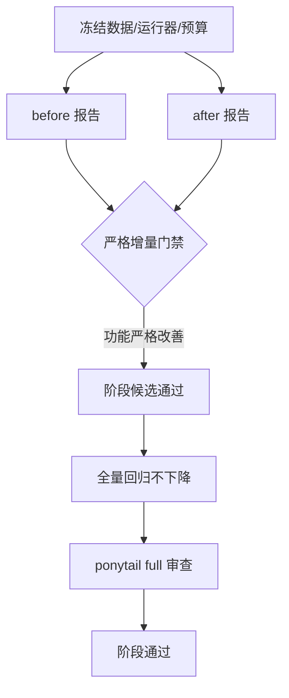

# Stage 6：Policy、Audit 与可信评测

## 问题

旧评测会把关键词、目标域名或存在的引用 ID 当成答案正确；安全、正确性和成本也混在一个 PASS 中。这样既可能把相反事实判对，也无法证明优化真的优于基线。

## 解决方案



H1、H2、H3 各自使用独立门禁。离线行为评测只证明 Harness 行为、协议和确定性成本变化；没有成功的真实网络/LLM 对照时，不宣称通用答案质量提升。

## 工作原理

### H1：先让分数可信

- 冻结 `50` 条 dev 和 `100` 条 test，版本 `2026-09-14.2`，跨 split 问题/组别分离。
- 多来源题校验规范化文档 URL 唯一性、required domain 和每个来源的 `source_version`。
- 最终答案重新解析每次 S/E 引用；正确率和 Claim 支持率只接受同时绑定答案及 Evidence 来源/正文快照的版本化标注。

最终校准 `evals/reports/h1-calibration-post-h3-p2-v7.json`：重建旧规则 `0/4`，`h1.4` 为 `4/4`。这是严格改善；H1 专项 `14/14`。旧规则实现是可执行重建，因为仓库没有不可变的 H1 前源码快照，报告没有把它冒充历史 commit。

### H2：安全边界和恢复

最终报告 `evals/reports/h2-post-h3-p2-v7.json`：冻结共享探针从 `1/7` 提升到 `7/7`；强化门禁 `14/14`，没有旧通过项回归。覆盖私网/DNS/重定向、凭据 URL、媒体类型、参数纠正、瞬态重试、final-only、计数和 malformed tool args。

### H3：正文和上下文

本轮 `evals/reports/h3-p2-after-v7.json` 与旧冻结 `h3-p2-before-v7.json`、本次收尾前 `h3-p2-pre-closeout-v7.json` 使用相同 runner、全部 H3 测试、数据和配置：

| 指标 | 旧冻结 P2 基线 | 本次收尾前 | 最终 |
|---|---:|---:|---:|
| 通过行为行 | 6/10 | 9/10 | 10/10 |
| 通过断言 | 92/118 | 115/118 | 118/118 |
| 证据可见性质量守卫 | 20/25 | 25/25 | 25/25 |
| 模型输入总字节 | 24,393 | 27,622 | 27,622 |
| 公开估算 token | 8,132 | 9,208 | 9,208 |

严格 gate 比较旧冻结 P2 基线，要求通过行和证据质量守卫严格改善、旧通过项零回归。当前输入成本比该基线增加，但仍低于历史 pre-H3 的 `69,493 bytes / 23,166` 估算 token 上界；本次收尾前后成本相同，不能宣称本次配对压缩率下降。估算是 UTF-8 bytes / 3 向上取整，不是供应商 tokenizer 计数。

质量守卫从模型实际可见证据生成答案，删除证据的负对照必须拒答。本次新增边界覆盖带说明文字/Markdown 的 JSON、JSON 字符串、转义 JSON，以及属性名凭据；60 组编码/包装组合均核对实际回答与 Trace。脱敏必须清洗键名及值，保留普通字段，且先保护 URL、Authorization 和带引号赋值的完整凭据边界，再处理 JSON 片段。已有短正文预算保持 693 通过、692 拒绝，Trace 只记录真实正文删改。

H3 本轮修复已完成最小实现和独立安全复核，未新增框架或第三方依赖。报告来源、反向补丁重建及版本冻结命令见 [评测文档](evaluation.md)。

### 真实网络边界

`evals/reports/live-dev-C-before-H3-20260914.json`
（SHA-256 `2cacb78e2ee31e5c95a90f30f53af9ae4c802c86cbcf6617b9aaf852ee1266bd`）
确实运行了 dev `50 x 3 = 150` 次，但每次首个模型 HTTP 请求都因 Windows 套接字权限
`WinError 10013` 失败。全部终止为 `model_error`、`0` 次网络工具请求、`150` 次均未标注；
请求外网权限升级也被拒绝。因此它只是一份工程失败工件，不能证明配置 C 或 H3 的真实质量收益，
也不能与离线结果合并。

## 试一下

```powershell
conda activate evidence-agent
python -m unittest discover -s tests -v
python evals/run_all.py
```

本次在字节一致的隔离副本中验证，`88/88` 单元测试通过，`run_all.py` 退出码 `0`；离线指标报告为 `evals/reports/offline-post-h3-p2-v7.json`。要复跑阶段门禁，请给 `--output` 使用新的、尚不存在的路径；评测器不会覆盖基线或历史报告。

真实评测会消耗模型和搜索额度：

```powershell
python evals/run_live_eval.py --split dev --runs 3 --max-tool-calls 6
```

只有网络可用、150 次运行完成并经过版本化标注后，才能报告真实正确率、Claim 支持率和成本。

## 接下来的章节

状态为 `PAUSED_FOR_RESEARCHAGENT`。H4 语义验证、H5 长期记忆和 H6 RL-ready 轨迹均未在本轮开始。
