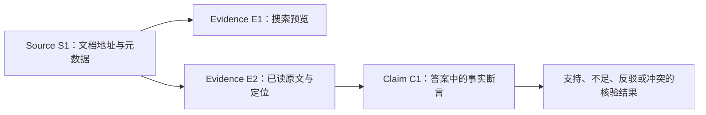

# 03｜证据链：找到链接之后，还没有完成事实核验

> 来源告诉你“哪里来的”，证据告诉你“哪段原文”，核验检查“是否支持这句话”。

[上一章](02-agent-loop.md) · [课程首页](README.md) · [下一章](04-workbench.md)

## 问题：有引用的答案为什么仍会错？

搜索结果可能只有预览；引用可能指向真实论文，但论文没有说答案中的数字；模型也可能把一个局部实验结果扩展成普遍结论。项目把这些问题拆成不同的数据结构和检查步骤。

## 最小机制：三层对象



| 对象 | 示例 | 本身不能证明什么 |
| --- | --- | --- |
| `Source` | 某论文 URL、标题、获取时间 | 不能证明整篇已经读过 |
| `Evidence` | 第 4 页的方法段、内容哈希、原文窗口 | 有一段证据不等于支持所有结论 |
| `Claim` | “该方法使用两阶段检索”及其 E 引用 | 模型给的置信度不等于事实正确 |

定义见 [contracts.py](../../research_agent/contracts.py)。`Evidence.kind` 区分预览、网页正文、本地文档、历史等来源角色；`provenance` 保存 artifact、chunk、页码、章节、行号等定位信息。

S/E 编号是一次运行的局部编号。两个子研究都有 E1 很正常，跨运行引用必须同时携带任务身份，不能直接拼成一张全局 E1 表。

## 源码走读：先检查“绑定”，再检查“支持”

| 顺序 | 入口 | 解决的问题 |
| --- | --- | --- |
| 1 | [evidence.py](../../research_agent/evidence.py) 的 `SourceCatalog.add` | 来源归一化、去重与 S 编号 |
| 2 | `EvidenceCatalog.add` | 保存不同种类的证据、哈希与定位 |
| 3 | `normalize_citation_format`、`validate_evidence_citations` | 引用写法能否解析、E 编号是否存在 |
| 4 | [verify.py](../../research_agent/verify.py) 的 `check_answer` | 用户要点是否覆盖、事实段落是否得到原文支持 |
| 5 | `apply_answer_patch`、`partial_answer` | 限定修订范围，保留已通过段落和不足说明 |

引用 ID 合法是程序可确定检查；“这段材料支持这句话”通常需要语义判断。两层缺一不可。

## 两类 verifier 要分清

早期 `verify_claims()` 用词法重合等规则给 Claim 做确定性诊断，适合离线回归，不等于语义正确性保证。当前真实模型路径中的 `check_answer()` 则按回答块核验原文支持、问题覆盖和冲突。

在线核验由当前选中的模型参与，结果分为：

| 状态 | 系统怎么处理 |
| --- | --- |
| `passed` | 按实际核验结果进入交付 |
| `needs_revision` | 在剩余预算内定向补读或局部修订，最多两轮修订 |
| `unavailable` | 保存待核验草稿和检查点，明确未完成，可恢复核验 |

核验器网络超时不应被算成“答案语义错误”，也不应放行成“已核验成功”。同一模型自查仍有共同盲点，因此真实评测和独立复算仍然必要。

## 为什么用段落补丁？

假设回答有三段，前两段已经通过，第三段误写了一个数字。如果每轮让模型重写全文，正确段落也可能被改坏。

项目为回答块建立稳定身份，修订只接受 `replace` / `append` 等受控补丁；未变段落在相应证据条件下可以复用判断。核验状态绑定草稿和证据，新增证据后不能盲用旧缓存。

这是“尽量保留已验证内容”的工程机制，并不能保证保留的判断永远正确。

## 一个贯穿示例

用户问：“这篇论文在数据集 X 上提升了多少？”

1. `search/retrieve` 给出候选，当前只有预览，不能回答精确数字。
2. `read/read_evidence` 读取实验段落，保留页码和窗口。
3. 模型写“在该论文的 X 设置下，指标 A 从 a 到 b [E2]”。
4. 检查 E2 存在；核验器检查指标名称、实验设置、数值和表述范围。
5. 若原文只有 b，没有可比基线 a，则删除无依据的提升幅度或说明缺口。

内容哈希帮助判断“这份证据是否变化”，不会自动证明论文结论真实。PDF 解析不到的扫描页、公式和图表，也不能由“下载成功”推断为“理解完成”。

## 动手验证

```powershell
& $tutorialPython -B -m unittest discover -s tests -p 'test_evidence_windows.py' -v
& $tutorialPython -B -m unittest discover -s tests -p 'test_qa_format_recovery.py' -v
```

再打开[核验流程测试](../../tests/test_verification_flow.py)，找出“基础设施失败”“合理证据不足”“错误事实需要修订”的区别。选择一份[历史真实报告](../auto-research-demo.md)，从一句话沿 E 引用追到原文。

完成标准：能展示“答案 → E 编号 → 原文位置 → S 来源”，并说明该段证据实际覆盖的范围。

## 面试表达与自测

“我没有把引用检测等同于事实核验。系统先检查引用身份，再检查段落与原文的支持关系；预览和正文分开，核验故障和内容不通过分开。修订通过局部补丁保留已通过内容，预算耗尽时明确交付缺口。”

自测：真实 URL 能证明 Claim 吗？为什么全文中找不到某句话不能由一个窗口推出？两个任务的 E1 如何避免混淆？
