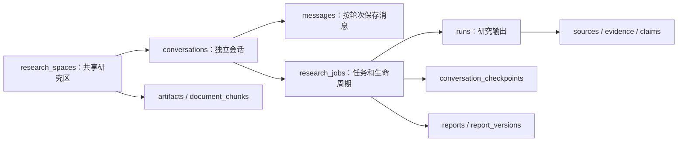

# 04｜研究工作台：请求结束，任务可以继续

> HTTP 请求、会话消息、后台任务与研究结果是四种不同对象。

[上一章](03-evidence.md) · [课程首页](README.md) · [下一章](05-retrieval.md)

## 问题：研究需要几十秒，浏览器该一直等吗？

如果把完整研究塞进一次同步消息请求，就很难表达排队、进度、取消和恢复。工作台把消息写入 SQLite，再创建有状态的后台任务，浏览器通过任务接口和事件流查看进展。

## 一次本地问答的真实调用链

```text
web/app.js 提交消息
  → server.Handler.handle_api()
  → Workbench.send()：保存用户消息
  → route_intent()：分类并形成执行简报
  → WorkbenchStore.enqueue()：持久排队
  → Workbench._work() / claim_next()：领取任务
  → Workbench.execute()：按任务类型组装 Agent
  → ResearchAgent.run()：检索、阅读、核验
  → RunStore.save() / 报告与研究档案
  → WorkbenchStore.finish()：保存交付及终态
  → 浏览器展示回答、来源、状态
```

当消息以 `background=True` 提交时，连意图分类也可以先作为 `pending_route` 入队。因此前端拿到 `QUEUED` 不意味着已经确定它是联网研究。

## 七种意图，决定不同能力

| 意图 | 主要动作 | 需要讲清的边界 |
| --- | --- | --- |
| `CHAT` | 普通交流、解释已有上下文 | 路由时没有新搜索，不能声称已查证 |
| `RESEARCH` | 搜索、原文阅读和研究交付 | 有研究深度与预算 |
| `LOCAL_QA` | 查询已保存资料、相关记忆和历史 | 关闭外部网络研究工具 |
| `DOWNLOAD` | 下载、保存、解析资料 | 下载完成不等于内容核验完成 |
| `BRAINSTORM` | 依据本区论文形成创新候选 | 候选是待验证假设 |
| `EXPERIMENT` | 引导/使用实验档案与显式执行入口 | 普通消息里的任意命令不会直接运行 |
| `AUTO_RESEARCH` | 研究主控按需调用研究与编码实验工具 | 包含本机执行能力检查与总预算 |

分类使用严格 JSON 合同：`intent`、`reply`、`brief`、`assumptions`、`effort`。格式纠正最多一次，已识别意图不能借纠正扩大工具权限。见 [workbench.py](../../research_agent/workbench.py) 的 `route_intent()`、`_parse_route()`。

## 数据模型：为什么不能只用一张聊天表？



图中表达概念关联，实际外键、字段和迁移以初始化代码为准。

| 概念 | 用途 | 关键代码 |
| --- | --- | --- |
| Space | 共享资料、Notes 与研究设置 | `WorkbenchStore.save_space` |
| Conversation | 独立聊天历史和分支边界 | `create_conversation`、`Sessions.fork` |
| Message | 某轮用户输入或助手消息 | `message`、`_message` |
| Job | 排队、运行、取消、失败和恢复 | `enqueue`、`claim_next`、`finish` |
| Run | 一次研究的结果与来源证据 | [storage.py](../../research_agent/storage.py) |
| Report/Version | 可持续管理的研究成果 | [research_records.py](../../research_agent/research_records.py) |

一次消息可触发任务；Auto Research 还会产生多个子任务和多版方案。因此 `conversation_id`、`job_id`、`run_id` 不能互换。

## SQLite 队列的关键点

在 [workbench_store.py](../../research_agent/workbench_store.py) 中，`enqueue()` 和 `claim_next()` 使用事务，领取时执行 `BEGIN IMMEDIATE`。选择可运行任务和更新状态处于一个写事务中，避免两个 worker 同时领取同一行。

普通同会话轮次有先后约束；只有明确登记为同批并行的子研究享有相应例外。当前是一个主 worker 加一个只领取显式并行子研究的额外 worker，不是所有后台任务都任意并行。

用 SQLite 的理由是本地单用户部署、状态与数据接近、事务简单。代价是单写者竞争、单机调度及吞吐边界。这个选择需要结合场景，不能宣称已经解决分布式高并发。

## 前端看到的是哪些事件？

[server.py](../../server.py) 提供会话 SSE：`/api/spaces/{space}/conversations/{conversation}/events`。事件持久化后带游标发送，前端可通过 `Last-Event-ID` 或 `after` 继续读取。

还有任务 Trace 事件读取接口 `/api/spaces/{space}/jobs/{job}/events`。它按序号返回 JSON，和会话 SSE 不是同一种传输。

模型流输出中的草稿尚未通过最终核验；UI 中的“正在生成”“正在核验”“完成”需要分开。主页面用原生 JS 实现，HTTP 服务基于 `ThreadingHTTPServer`，这里没有前端框架或外部消息队列。

## 动手验证

运行第 01 章隔离 Web 示例，创建两个会话，分别发送不同主题。观察：同区共享资料，但新会话不会自动复制前一会话的全部聊天。

```powershell
& $tutorialPython -B -m unittest discover -s tests -p 'test_workbench.py' -v
```

读 [server.py](../../server.py) 中 `/messages`、`/jobs`、`/events` 的路由，再追到对应 `Workbench` 方法。完成标准：能解释浏览器刷新后为什么仍能找到任务，以及为什么 HTTP 202 只表示接受处理。

## 面试表达与自测

“我把对话和执行解耦：会话保存交互语义，Job 保存长任务状态，Run 保存可复查输出。SQLite 事务承担本地排队与原子领取，事件流展示进度。这样任务可取消、可恢复，页面刷新不会丢失已经持久化的状态。”

自测：`CHAT` 是否完全不调用模型？`EXPERIMENT` 分类是否等于执行任意代码？一个后台任务完成能否直接推导其所有事实都正确？
