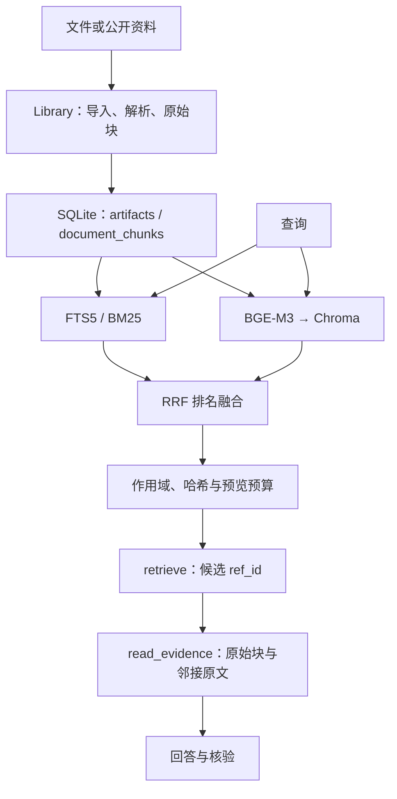

# 05｜混合检索：召回片段，再打开原文

> 检索解决“去哪里找”，阅读解决“到底写了什么”。

[上一章](04-workbench.md) · [课程首页](README.md) · [下一章](06-memory-context.md)

## 问题：只靠关键词或只靠向量有什么缺口？

关键词检索擅长精确术语、函数名和缩写，但可能漏掉语义改写；向量检索擅长语义接近，但也可能把主题相关、事实无关的片段排在前面。本项目把两者融合，再由 Agent 读取候选原文。

## 从文件到回答的两条链



资料导入负责构建可追溯的原始内容；检索索引负责加速定位。二者生命周期不同：向量可以重建，原文与用户记录不能随便丢掉。

## 源码走读

1. [library.py](../../research_agent/library.py) 的 `import_bytes()`、`ingest()`、`chunks()`：看 artifact 与原始 document chunk 如何保存。
2. [retrieval.py](../../research_agent/retrieval.py) 的 `DenseIndex.segments()`：当前编码窗口按 tokenizer 切分，窗口 510 token、步长 446，模型上限设为 512。
3. `Retriever.sync()`：为 documents / memory / history 建索引，并保留原文位置与内容哈希。
4. `Retriever.retrieve()`：执行 BM25、向量检索、融合、可选重排与预览裁剪。
5. `Retriever.read()`：回到当前可见原文，重新检查作用域、来源状态和哈希。

这里的 embedding window 与原始文档块不是同一个对象。召回一个短向量窗口后，阅读会回到其原始父块；邻接读取也按原始块扩展，保留各自定位。

## RRF：为什么可以融合两个不同分数体系？

代码中对每个排名列表累加：

```python
score[ref] += 1 / (60 + rank)  # rank 从 1 开始
```

这是真实实现中的核心公式，完整去重和过滤见 `Retriever.retrieve()`。RRF 使用排名，避免直接相加 BM25 与余弦距离这类尺度不同的分数。

例如片段 A 在 BM25 排第 1、向量排第 5，得分为 `1/61 + 1/65 ≈ 0.03178`；片段 B 只在一个列表排第 1，约为 `0.01639`。跨通道都出现的候选可能更靠前。这是排序启发式，仍然需要评测，不能推导每题都更好。

本项目用 BGE-M3 生成 dense embedding；BM25 来自 SQLite FTS5。不要把“模型名为 BGE-M3”说成同时启用了它的所有稀疏或多向量能力。

## 三个工程细节很适合深入讲

**第一，向量命中后回表。** Chroma 中的旧向量可能尚未物理删除，返回结果要在 SQLite 当前记录中存在且哈希一致才可用。相似度高不能绕过已删除资料或失效记忆。

**第二，检索作用域显式化。** `corpus` 区分 `documents`、`memory`、`history`；`scope` 区分 `current`、`workspace`、`all_sessions`。跨会话检索保留来源会话与研究区，遵守用户限制，不把历史自动拼进新会话。

**第三，降级可见。** `Retriever.prepare()` 只加载已经准备好的本地权重；`RETRIEVAL_MODE=lexical` 明确禁用语义检索。权重或索引不可用时保留错误信息和词法能力，不能把降级后的运行报告成完整混合检索。

## 原文窗口：大文档怎么读？

`retrieve` 返回候选及短预览；`read_evidence` 使用 `ref_id` 或本次运行的证据身份读取正文。窗口返回 `next_offset`、总长度和位置，Agent 可以继续读；邻接原文分别保存引用，避免把几页内容都绑定到一个页码。

“读取了一个窗口”“覆盖了若干窗口”“完整理解一篇论文”是不同说法。搜索预览也不能通过换一个 E 编号升级为已读正文。

可选的 `evidence_rerank.py` 在有限候选原文上做重排，由 [strategies.py](../../research_agent/strategies.py) 接入。它受调用预算与候选规模约束；不能视为默认启用、无限全文阅读的保证。

## 动手验证

在隔离工作台上传一份自己熟悉的文本资料，提出一个包含精确术语的问题，再用另一种表达提问。记录候选是否命中、是否真正打开原文、答案引用是否正确。离线模型的回答仅供流程演示；真实语义比较要在已配置模型下单独评测。

不需要网络的结构回归：

```powershell
& $tutorialPython -B -m unittest discover -s tests -p 'test_evidence_windows.py' -v
```

更深入可读 [test_context_memory.py](../../tests/test_context_memory.py) 和[产品评测](../../evals/reports/product-benchmark-20260929/report.md)，核对真实 baseline 与 candidate 的区别。

## 面试表达与自测

“资料原文和来源身份存 SQLite，Chroma 是可重建的向量索引。查询用 FTS5/BM25 与 BGE-M3 dense 检索，经 RRF 融合，再校验当前可见性与哈希。Agent 先找候选，再打开原文核验，因此 Recall 改善不能直接写成答案准确率改善。”

自测：为什么不直接把 BM25 和向量分数相加？资料已删除但向量还在会怎样？`retrieve` 命中为什么还需要 `read_evidence`？
