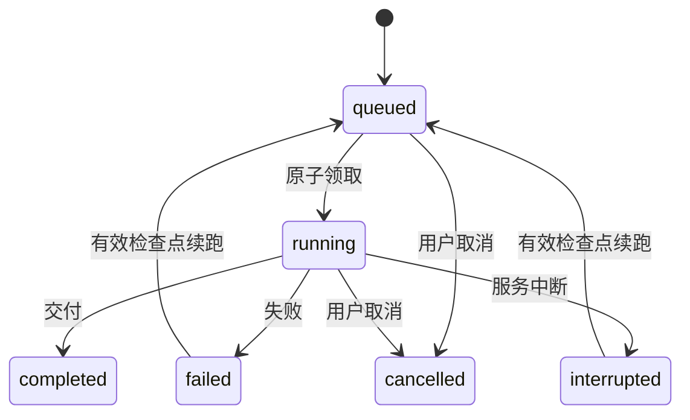

# 07｜恢复与可观察性：知道停在哪里，才能安全地继续

> 恢复复用已提交状态；没有收据的外部动作不能假装从未发生。

[上一章](06-memory-context.md) · [课程首页](README.md) · [下一章](08-auto-research.md)

## 问题：工具返回后进程退出，下一次该从哪里开始？

简单重新跑整段程序会重复搜索、重复付费调用，甚至重复执行实验。仅仅保存聊天文本，也无法恢复已经消耗的预算、待核验草稿和工具队列。

项目同时保存运行事件和执行检查点。事件解释发生过什么，检查点恢复下一步所需的结构化状态。

## 三种记录各管一件事

| 记录 | 作用 | 主要入口 |
| --- | --- | --- |
| JSONL Trace | 可读的运行事件、工具行为和停止原因 | [trace.py](../../research_agent/trace.py) |
| `conversation_events` | 会话进度、流输出、用量等持久事件 | `Sessions.event` |
| `conversation_checkpoints` | 工具/证据状态、消息、预算、核验等恢复快照 | `Sessions.save_state` |

压缩检查点保存“当前任务怎么理解”；执行检查点保存“程序恢复需要的状态”。它们都可能出现在检查点机制中，但用途不同。

## 生命周期与恢复入口



Auto Research 在等子任务时也可能是 `queued + auto_waiting`，但普通领取器会跳过它；结束还需看业务 `outcome`，见第 08 章。

在 [sessions.py](../../research_agent/sessions.py) 读 `save_state()` → `resume()` → `resume_state()`：

1. 检查任务属于当前研究区，状态允许续跑。
2. 找到有效 execution checkpoint。
3. 检查 `memory_revision`，避免用已忘记/修改的旧上下文。
4. 检查当前会话没有冲突的活动任务。
5. 设置 `resume_checkpoint_id`，增加 `execution_generation`，回到队列。

资料下载等外部写入有专门重试规则，不能一律按纯研究检查点重放。

## Resume 与 Retry

| 操作 | 身份与状态 | 适用场景 |
| --- | --- | --- |
| Resume | 同一 Job，从有效检查点继续，新 execution generation | 研究失败/中断且恢复条件仍有效 |
| Retry | 新 Job，保存 `retry_of` 关联 | 重新研究、已取消任务或不能续用旧检查点 |

Auto Research、编码、注册实验还有各自收据和合同校验；不是所有失败都能无条件继续。恢复应保留历史失败，而不是把旧任务改成“从未出错”。

## 执行代次：防止迟到结果污染新状态

设任务第一次运行的 generation 为 0，网络请求较慢；用户中断后从检查点恢复，generation 变为 1。旧请求此时返回，仍可能调用回调。

`Sessions.event()`、`save_state()` 等关键写入会核对“任务仍在运行且代次匹配”。旧代次不能发布新一轮结果。这比只检查 `job_id` 更严格，因为恢复后 Job 身份可以不变。

取消和完成也存在竞争：`finish()` 只提交仍为 running 的任务，取消先成功时不能被后到完成覆盖。已经发出的供应商请求可能仍在收尾，程序不能保证点击取消后外部立即停止计费。

## Exactly-once 的实际边界

已提交的工具结果可复用，同一调用 ID 的委派可以幂等；但工具实际完成与检查点提交之间仍有窗口。只读动作可能重复，未知结果的付费调用/实验不能自动认定可安全重放。

因此，准确说法是“基于已提交检查点恢复，并对关键委派和收据做幂等控制”，不是“所有外部操作严格执行一次”。

## 成本同样需要可观察

[usage.py](../../research_agent/usage.py) 规范化 input/output/total/cache token，并汇总覆盖率。缺失指标用未知值表示，不能当成 0。

还要区分逻辑模型调用与物理 HTTP 尝试：一次 `complete()` 可能触发传输重试；压缩、核验、路由、记忆提取也会调用模型。比较成本时要包含这些辅助请求，不能只数最终回答那一次。

Trace 会脱敏，不把私有思维链当作教程证据。需要精确恢复的宿主私有请求收据有自己的保存与隔离规则，不等于前端公开日志。

## 动手验证

阅读 [test_auto_research.py](../../tests/test_auto_research.py) 的以下测试名称，再找到对应检查代码：

- `test_saved_model_response_resumes_without_another_paid_request`
- `test_unknown_inflight_response_never_replays_on_resume`
- `test_invalidated_memory_does_not_reset_state_or_restart_research`

```powershell
& $tutorialPython -B -m unittest discover -s tests -p 'test_auto_research.py' -v
```

完成标准：给出“已提交工具结果”“无收据在途请求”“记忆已变更”三个故障点的恢复决策。无需为了学习关闭日常服务或中断真实实验。

## 面试表达与自测

“恢复依赖结构化执行检查点，不靠重放整段聊天。检查点绑定记忆版本，恢复时增加执行代次，阻止旧回调写入。对已提交工具结果和任务委派做复用，对未知外部执行保守处理，并保留失败及未知用量。”

自测：为什么有数据库事务仍不能保证外部 API exactly-once？为什么不能在记忆变更后继续旧检查点？为什么模型 token 未返回不能填零？
