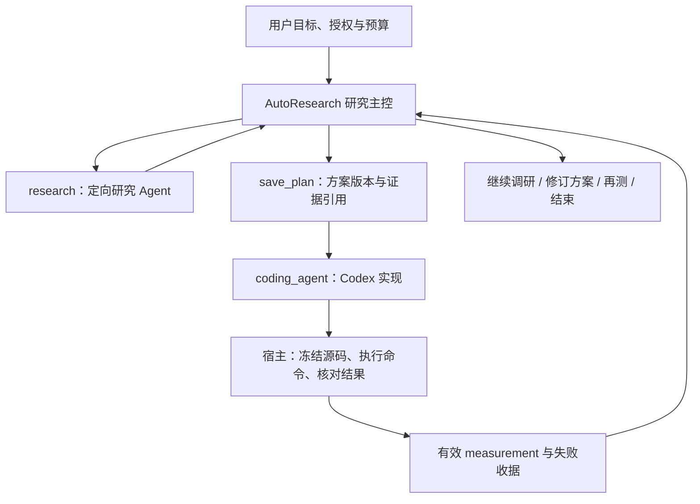

# 08｜Auto Research：把实测反馈送回研究决策

> 研究模型选方向，编码 Agent 实现，宿主提供可追溯测量。

[上一章](07-recovery.md) · [课程首页](README.md) · [下一章](09-parallel-research.md)

## 问题：写出研究报告之后，怎样验证提出的方法？

普通研究 Agent 的交付主要是有证据的答案。Auto Research 则围绕更长的目标：读原文、保存假设和方案、委派代码、运行比较，再根据实际反馈决定继续或结束。

因此这里有两层循环：内层 `ResearchAgent.run()` 完成一次定向研究；外层 `AutoResearch.execute()` 管理整个研究目标和多次委派。Codex 自己也有编码循环，但该能力属于接入的外部 Agent。

## 三个角色与信任边界

不是每次必须走完所有框。已有代码可直接运行；缺原文可继续读取；假设不成立也可以带负结果结束。选择由模型作出，权限、预算、合同与判定前提由程序检查。

## 主控实际有哪些工具？

工具定义在 [auto_research.py](../../research_agent/auto_research.py) 的 `TOOLS`：

| 工具 | 含义 | 关键约束 |
| --- | --- | --- |
| `prepare_project` | 宿主准备公开代码、数据与固定版本依赖 | 来源和版本留痕，限定准备次数及下载量 |
| `research` | 启动一次 web/local 子研究 | 消耗研究次数；返回子任务身份 |
| `research_parallel` | 委派两个独立子问题 | 一批恰好两项，原子创建，下一章详解 |
| `save_plan` | 保存 baseline、hypothesis、method、validation 等 | 证据绑定子任务 ID 和 E ID；状态为 HYPOTHESIS |
| `coding_agent` | 按已有方案委派 Codex | 要求有效方案版本和授权预算 |
| `run_experiments` | 对已有代码直接实测 | 不再启动编码，使用实验预算 |
| `assess_results` | 对有效实测结果做同条件比较 | 比较合同与基线匹配，不替代科学判断 |
| `inspect` | 查看历史任务、方案、项目文件和证据窗口 | 返回范围与读取进度，不能把目录当正文 |
| `finish_research` | 交付总结与限制 | 区分 reported / goal_met / blocked / budget_exhausted |

当前默认总预算包括 40 次决策、8 次子研究、4 次编码委派，以及编码时间/token、实验时间、实验模型调用等独立额度。准确默认值和上下界读 `DEFAULT_BUDGET`、`LIMITS`；示例中的预算不是费用上限，也不是保证一定耗尽。

## 长委派如何不阻塞主控？

源码阅读顺序：`execute()` → `decide()` → `dispatch()` → `yield_job()` → `tick()`。

1. 主控获得结构化工具决策并保存状态。
2. `research` 或 `coding_agent` 创建持久任务，记录 `waiting`。
3. 父任务变为 `queued / auto_waiting`，把 worker 让出。
4. `tick()` 只读任务状态；委派运行期间不反复调用模型询问“做完了吗”。
5. 终态结果进入主控消息，模型决定下一步。

当前 Auto Research 状态复用 `research_jobs` 和 `conversation_checkpoints`；方案保存在控制器状态中，并与研究成果档案衔接。早期设计文档里拟议的独立 `auto_research_runs` 表不能当作当前实际实现。

## CodingTool 的核心合同

先读 [coding_tool.py](../../research_agent/coding_tool.py) 的 `validate_request()`、`submit()`、`execute()`，再进入 [experiment_process.py](../../research_agent/experiment_process.py) 的进程和隔离逻辑。

一项实验命令明确包含 `name`、`role`、`script`、`args`、`result_path`、`seconds`。`role` 区分 baseline、candidate、ablation、diagnostic；每组写自己的结果文件，不能只在自然语言里说“做三组对比”。

宿主保存代码状态、变化与保护文件身份，按合同执行 Python 入口、记录退出码与产物，并在支持的指标合同下进一步核验预测和分数。任意脚本输出一段 JSON，不自动成为独立科学验证；自写 baseline 的公式、标签使用和评分逻辑仍需要审查。

`source_changes` 为空时不能声称完成了新方法实现。Codex 的 `summary` 是自述，即使含有漂亮数字，也不等于有效 `measurements`。

## 实验需要调用模型，但不能拿到密钥

项目支持两种宿主桥接方式：

| 方式 | 数据流 | 适用场景 |
| --- | --- | --- |
| JSONL 批次 | 脚本准备 `{id,messages}` → 宿主调用 → 响应 JSONL → 脚本读结果 | 输入可预先确定 |
| stdio 连续交互 | 脚本输出 `RESEARCH_MODEL_REQUEST` → 宿主响应 stdin → 脚本构造下一请求 | 记忆演化等依赖前次回答的实验 |

模型凭据由宿主管理；实验脚本拿到限定响应。请求和输出绑定收据与哈希，并共享父预算。调用重试和用量未知仍如实记录，不能只按脚本收到的成功响应数计成本。

详见[宿主模型接口](../v4-host-model-interface.md)。其中有历史“待合入”段落，当前参数支持情况以 `coding_tool.py` 校验函数为准。

## 执行隔离的实际能力

当前编码/实验面向本机 Windows 原生 Codex 环境。`clean_environment()` 清理子进程环境；文件规则限制写入工作目录，并拒绝已列出的宿主私有位置；数据和评分文件可冻结；进程层管理超时、取消和输出上限。

原生实现仍有 root read 等平台限制，不能称为虚拟机或完整只读白名单。对未知代码的安全边界应按实际平台合同说明，而不是用“有 sandbox”概括一切。

## 两种 V4 路径与成果版本

| 路径 | 主要入口 | 特点 |
| --- | --- | --- |
| 注册实验有限迭代 | `Experiments.prepare/submit/execute` | 面板显式提交、已注册评测合同、有界轮次 |
| Auto Research | `AutoResearch` + `CodingTool` | 模型选择研究、方案、编码或实测工具 |

成果层 [research_records.py](../../research_agent/research_records.py) 保存报告版本、实体关系、创新候选与实验版本。实验比较需要可比的配置、数据切分和指标；`HYPOTHESIS` 必须保留未验证性质。关系图基于 SQLite 的实体/关系记录，不能描述成已经实现通用 GraphRAG。

## 结束不只有“成功”

`completed` 是后台任务生命周期；`outcome=reported` 表示已经交付研究报告；`goal_met` 才要求冻结的数值目标得到有效宿主测量支持。论文质量或全领域 SOTA 不能由一组项目内分数推出。

动手：读 [Auto Research 测试](../../tests/test_auto_research.py) 与[完整交付报告](../../evals/reports/v4-delivery-final-20261002/report.md)，寻找“代码执行失败”和“假设未获支持”各一个例子。沿 `plan_version → task_id → measurements → assessment` 追一次结果。普通学习无需重新启动付费编码实验。

## 面试表达与自测

“我将 Codex 工具化，研究模型负责问题和方案，编码 Agent 负责局部实现，宿主负责执行合同、收据和测量。结果回到同一持久研究任务后，再决定补证据、改方案或停止。工程贡献是这套协作与验证机制，不把外部编码模型能力归为自研。”

自测：为什么已有代码时用 `run_experiments`？测量可复算能否证明 baseline 实现正确？`completed`、`reported`、`goal_met` 分别说明什么？
