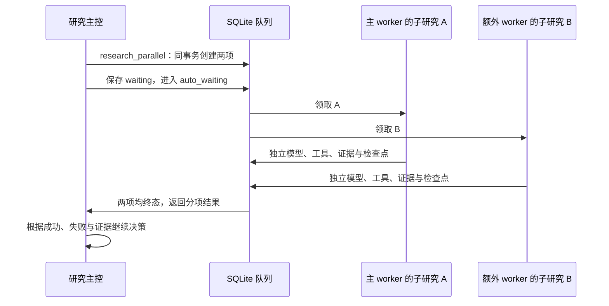

# 09｜有限并行：两个独立研究怎样安全汇合？

> 并行的重点是任务身份、历史边界和结果汇合，速度要单独实测。

[上一章](08-auto-research.md) · [课程首页](README.md) · [下一章](10-evaluation.md)

## 问题：主控需要两方面资料，能否同时研究？

例如“分别查清一篇论文的方法与评测设置，再汇总实验方案”。当两个问题互不依赖时，可以分给两个各自运行工具循环的研究 Agent。若第二项必须先知道第一项的结果，应顺序调用 `research`。

当前实现是一层主控、最多两个研究槽；编码与实验仍沿用原串行执行器。不是任意递归生成 Agent，也不以多线程数量定义研究质量。



## 源码走读：四个位置

| 位置 | 重点 |
| --- | --- |
| [auto_research.py](../../research_agent/auto_research.py) 的 `dispatch()` | `research_parallel` 参数、预算、幂等与原子创建 |
| [workbench_store.py](../../research_agent/workbench_store.py) 的 `claim_next()` | 同批子任务可并发，同会话后续轮次不能越过父任务 |
| [workbench.py](../../research_agent/workbench.py) 的 `_work_parallel()`、`execute()` | 第二槽只接显式批次；子研究按固定历史组装上下文 |
| `AutoResearch.parallel_result()` 与 `tick()` | 等待两项终态，返回每路失败和证据身份 |

## 原子性与幂等不是同一件事

**原子性：**每批恰好两个合法且不同的子问题，预算至少剩两次。在一个 `BEGIN IMMEDIATE` 事务中校验和创建。第二项创建失败时整批回滚，避免留下半批任务。

**幂等：**同一父任务与 `call_id` 再次提交时，查找原有子任务。内容一致则复用；同 ID 但参数不一致则冲突，避免重启或重试重复创建与扣预算。

调用结果需要记录两个子任务 ID。只把两个回答字符串拼接起来，会丢失“谁失败了”“E1 来自哪路”“对应哪次尝试”等信息。

## 独立上下文不等于独立数据库会话

两个子研究各自有模型消息、工具状态、证据和检查点；它们可以使用父任务所属的 `conversation_id`，但通过 `auto_batch`、`auto_index`、`auto_context_turn` 和 `auto_context_revision` 明确边界。

并行子任务使用父用户轮次之前的历史边界；当前子问题单独作为任务输入。兄弟刚生成的答案不会混入另一方初始历史，父任务之后的新用户消息也不会悄悄改变已开始的子研究。

主控拿到的证据必须表示为 `(job_id, evidence_id)`。不同子研究的 E1 不是同一段原文。

## 取消与记忆变化怎么传播？

取消父任务时，在同一事务中取消仍活动的子研究，不等到主控下次 tick 才处理。worker 执行前、事件回调和状态保存继续检查父任务与当前状态；在途请求返回后停止后续动作。

历史或记忆变化导致上下文版本失效时，子研究不能继续使用旧边界。旧请求的费用和失败收据仍需保留，不能因为取消就从统计中消失。

共享 SQLite、资料库、检索与模型权重等资源仍可能存在锁和竞争。因此理论上 `max(Ta,Tb)` 的并行耗时，还要加调度、汇合、排队、模型与网络延迟。

## 真实实验告诉我们什么？

[2026-10-03 实测](../../evals/reports/parallel-research-final-audit-20261003/report.md)使用 4 道项目问题，2 组 × 2 次重复 × 单/双 worker，共 8 个父任务、16 个子研究：

| 观察 | 结论 |
| --- | --- |
| 16 个子研究全部交付，4 次双 worker 均有时间重叠 | 双路研究确实运行 |
| 严格合同 6/8 通过 | 运行完成不等于要求全部保持 |
| 两次转交遗漏“不联网”文字，但 LOCAL_QA 能力边界仍在 | 提示层约束转交有缺口，宿主限制仍有效 |
| 全部配对合计 651.984 秒 → 706.297 秒 | 总体慢 8.33%，没有证实总体加速 |

不能只挑最快一次宣称“性能提升”。任务是否适合拆分、提示转交、共享资源和模型生成路径都影响收益。

## 动手验证

```powershell
& $tutorialPython -B -m unittest discover -s tests -p 'test_parallel_research.py' -v
```

重点读 [test_parallel_research.py](../../tests/test_parallel_research.py) 中：

- `test_batch_is_atomic_budgeted_idempotent_and_keeps_frozen_context`
- `test_siblings_overlap_but_later_turn_cannot_overtake_parent`
- `test_join_delivers_failed_branch_and_scoped_evidence_without_polling_model`

完成标准：分别解释“预算只剩一次”“一路失败”“父任务取消”“同 call_id 重试”时系统应该做什么。

## 面试表达与自测

“我实现的是有界双路研究协作：主控原子委派两个独立问题，子研究有独立模型状态和证据，汇合时保留失败与任务级引用。SQLite 负责幂等、轮次顺序及父子取消。真实对照证明运行和重叠，但这组数据没有总体提速，所以我将并发能力与性能收益分开报告。”

自测：为什么单次模型返回两个 tool call 不等于两个研究 Agent？一路成功时主控能否假设整批完成？同一 `conversation_id` 下如何保持两路上下文独立？
