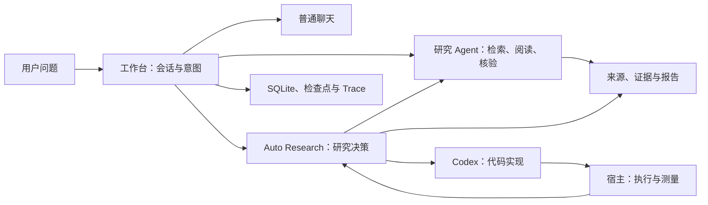

# Learn ResearchAgent：从一次工具调用到可追溯的研究工作台

> 模型选择下一步，程序约束执行，证据支撑结论。

这套教程面向“刚接手项目，想快速读懂代码，并在面试中讲清楚”的读者。只需要基本的 Python、HTTP 和数据库知识。内容以 **2026-10-03 的当前源码**为准（编写时源码基线 `59327cb`）；历史测量会标明日期、数据范围和限制。

项目已经有 Stage 1–7、H1–H3、V1–V4 等多条历史文档线。本教程按理解依赖重新组织：先跑最小循环，再看工作台如何保存任务，最后进入自动研究和实测评估。章节编号是阅读顺序，不表示仓库存在对应的独立历史版本。

## 先用一句话认识项目

**ResearchAgent 是一个面向论文和技术研究的本地工作台：围绕模型的工具循环，增加原文证据、混合检索、分层记忆、任务恢复与受控实验，把一次回答扩展成可检查、可继续的研究过程。**

日常路径处理聊天、调研、资料问答和头脑风暴；用户明确要求自动研究时，研究控制器才可以委派子研究和 Codex，并根据宿主实际测量继续决策。模型接入、数据库和 HTTP 服务主要由普通 Python 显式编排。

## 三条学习路线

| 可用时间 | 阅读安排 | 读完要能做什么 |
| --- | --- | --- |
| 30 分钟 | 00 项目地图 → 01 离线运行 → 11 面试中的 90 秒讲稿 | 指出入口、说清主流程，展示一条真实 Trace |
| 半天 | 00–07，执行对应小练习 | 从一次问题追到来源、证据、数据库与恢复检查点 |
| 两天 | 全部章节，挑 2 个机制深入代码，复述一次负结果 | 解释设计取舍、并发边界、评测口径，接住追问 |

每章遵循同一个节奏：**问题 → 最小机制 → 源码走读 → 动手验证 → 面试表达 → 自测**。标为“教学伪代码”的片段用于解释控制流，完整实现以源码链接为准。练习复用现有入口与测试，不另造一套与生产脱节的 Agent。

各章 PowerShell 练习默认沿用第 01 章创建的 `$tutorialPython` 变量和显式离线环境，并在项目根目录运行。Python 的点号方法名用于定位类/函数；文档链接都指向仓库内现有文件，可直接跟读。

## 课程目录

| 章 | 本章只抓住一个机制 | 关键源码 |
| --- | --- | --- |
| [00 项目地图](00-project-map.md) | 按一次请求的流向理解目录 | `main.py`、`server.py`、`research_agent/` |
| [01 跑通最小闭环](01-first-run.md) | 先观察确定性行为与 Trace | `main.py`、`models.py`、`trace.py` |
| [02 Agent Loop 与工具合同](02-agent-loop.md) | 模型提议动作，宿主校验并执行 | `loop.py`、`contracts.py`、`policy.py` |
| [03 从来源到可信结论](03-evidence.md) | Source → Evidence → Claim → 核验 | `evidence.py`、`verify.py` |
| [04 从 CLI 到研究工作台](04-workbench.md) | 请求、会话、任务与运行结果分开存 | `workbench.py`、`workbench_store.py` |
| [05 混合检索与原文阅读](05-retrieval.md) | 召回候选之后还要打开原文 | `library.py`、`retrieval.py` |
| [06 记忆与上下文](06-memory-context.md) | 原始记录、可用记忆和当前输入分层 | `sessions.py`、`memory.py`、`context.py` |
| [07 长任务的恢复与可观察性](07-recovery.md) | 从已提交检查点继续，拒绝旧代次写回 | `sessions.py`、`trace.py`、`usage.py` |
| [08 Auto Research 与编码实验](08-auto-research.md) | 研究决策、代码实现和宿主测量分工 | `auto_research.py`、`coding_tool.py` |
| [09 有限 Multi-Agent 并行](09-parallel-research.md) | 原子委派、独立上下文、等待汇合 | `auto_research.py`、`workbench_store.py` |
| [10 评测与反馈策略](10-evaluation.md) | 每个数字都要有分母、条件和证据 | `evals/`、`datasets/`、`strategies.py` |
| [11 面试讲解与演示](11-interview.md) | 用问题、机制、证据、取舍组织表达 | 上述模块与历史报告 |

## 学习时始终追踪这条主线

以“根据我保存的论文解释一个方法，并给出原文依据”为例：

1. `server.py` 接收消息，`Workbench.send()` 保存用户轮次。
2. `route_intent()` 判断为 `LOCAL_QA`，创建后台任务。
3. worker 领取任务，组装仅本地可用的 `ResearchAgent`。
4. `retrieve` 返回候选位置，`read_evidence` 打开原文。
5. 模型形成回答，程序检查引用，在线核验逻辑检查要点和段落支持。
6. 保存运行、报告、来源与证据，前端展示最终状态。

接着只改变一个条件：若用户要求“提出方案、实现并按实验反馈迭代”，入口会进入 `AUTO_RESEARCH`，并在普通研究 Agent 上面增加一层可持久化的研究决策循环。

## 参考项目及采用的写法

本次实际阅读了以下公开项目的 README 和具体教学页面。借鉴其组织方法，本文的代码解释、练习与结论均对应 ResearchAgent。

| 参考 | 借鉴内容 | 本教程如何适配 |
| --- | --- | --- |
| [learn-claude-code](https://github.com/shareAI-lab/learn-claude-code) / [Agent Loop 章](https://github.com/shareAI-lab/learn-claude-code/tree/main/s01_agent_loop) | 一章一个机制，先提出问题，再拆解循环 | 从 `ResearchAgent.run()` 出发逐层理解 Harness |
| [claw0](https://github.com/shareAI-lab/claw0) / [会话与上下文章](https://github.com/shareAI-lab/claw0/blob/main/sessions/zh/s03_sessions.md) | 架构图、核心代码走读、递进依赖 | 对应本项目的 SQLite 会话、检查点和双研究槽 |
| [learn-workbuddy](https://github.com/adongwanai/learn-workbuddy) / [Learning Guide](https://github.com/adongwanai/learn-workbuddy/blob/main/docs/learning-guide.md) | 快速路线、深度路线、每阶段验收 | 给出可离线练习和“能够解释什么”的完成标准 |

这些项目中的 Bash 工具、消息通道、Sidecar、MCP 等机制不自动属于 ResearchAgent；以本教程指向的源码为准。当前项目也没有用 LangGraph、Celery、Redis 或图数据库承载主流程。

## 与原有文档的关系

- 初学者从本教程开始；[Stage 1](../stage1.md) 至 [Stage 7](../stage7.md) 用于理解早期增量。
- 操作细节看 [V1](../v1.md)、[V2](../v2.md)、[研究成果档案](../v3-research-records.md)。
- 当前演示与真实产物看[演示入口](../auto-research-demo.md)。
- 简历原稿看[当前简历入口](../resume/README.md)，数字边界看[指标依据](../resume/researchagent-20261003-evidence.md)。
- `HANDOFF.md` 是按时间追加的开发交接记录；旧“计划”“待合入”“运行中”要结合时间和当前源码理解。

## 本次教程验证

2026-10-03 已检查全套本地链接、12 个 PowerShell 代码块及 Python 示例语法，项目地图覆盖全部 39 个生产 Python 模块。实际运行了问候、固定来源研究、搜索失败三个离线 CLI 场景；Stage 1 验收 4/4，通过已有 `test_stage1.py` 的 21 项测试。

另在独立临时数据库和空闲本机端口验证了 Web 健康接口、页面、研究区/会话创建、离线聊天、后台研究完成及独立 Trace，随后关闭教学服务。其余章节列出的测试是进一步学习入口，没有在本次文档编写中全部重跑；历史在线成绩直接引用原始报告，没有作为本轮新测量。

开始：[00｜项目地图](00-project-map.md)。
